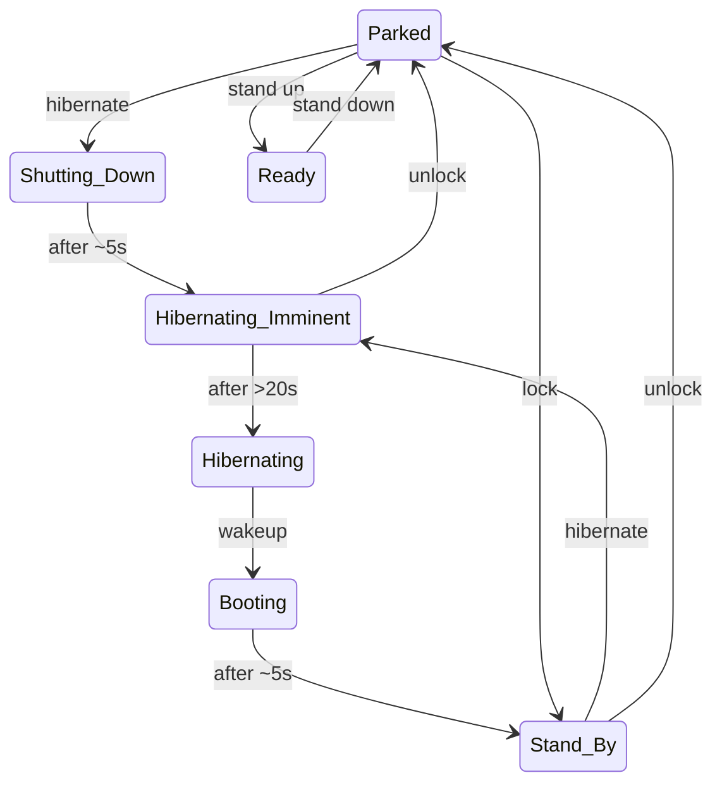

# Tech documentation of Unu Scooter Pro

This repository contains the tech documentation of some of the unu scooter
internals. This is reverse-engineered based on the scooter.

## Scooter states



## Services

The scooter provides different services which are connected to each other.

### DBC

You can connect to the DBC by using the following IP:

```
192.168.7.2
```

## Other services

* [Bluetooth](bluetooth/)
* [Redis](redis/)
