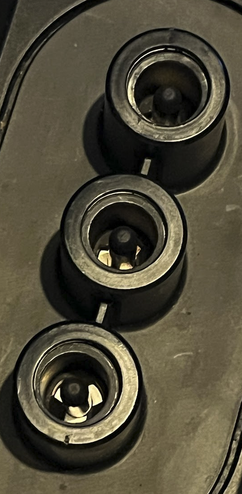

# unu Scooter Pro Battery Charger

* Input: AC 220-240V
* Output: 58.2V / 2A

Manufactured by QQE Technology Co. Ltd., Taiwan
Model number QQE287-18CH03-L

## Connectors

The battery is placed on top of the charger and mates its two encased sockets with the charger's three encased & spring-loaded pins. Middle pin is GND, outer pins are V+.

Charging contacts are customized ITT Cannon canted coil sockets ([Source](https://www.tti.com/content/dam/ttiinc/products/Verticals/ITT-Cannon-unu-Case-Study.pdf)):

> Derived from the leading ITT Cannon range of EV-charging products, this bespoke solution featured high-performance canted coil socket contacts for the battery and corresponding pin contacts for the scooter and charging dock.

- Pin Socket:
  - Outer Housing:
    - ID: 17mm
    OD: 25.5mm
  - Inner Housing:
    - Depth (rim to bottom): 30mm
    - ID: 13mm
  - Pin:
    - Cap OD: 5.50mm
    - OD: 5.5mm tapered to 6.5mm
- Battery Connector:
  - Pin Pitch: 30mm (Center to Center)
  - Length: 90mm (Outer housing, 3 pins)
  - Width: 25mm (Outer housing)
