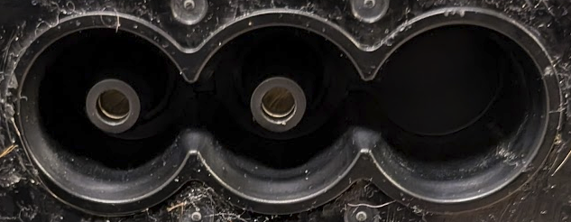

# unu Scooter Pro Main Battery

- Li-ion Battery
- Configuration: 14s7p using INR22/71-7 cells
- Specifications:
  - Nominal voltage: 50.8V
  - Max charging voltage: 58.2V
  - Nominal capacity: 35Ah/1778Wh
  - ~5000mAh per cell
- Features:
  - NFC communication
  - Built-in status LEDs
  - Protection circuits
  - Battery Management System
- Manufactured by TWS Technology Ltd., Guangzhou City, China

## External Connectors

Charging contacts are customized ITT Cannon canted coil sockets ([Source](https://www.tti.com/content/dam/ttiinc/products/Verticals/ITT-Cannon-unu-Case-Study.pdf)):

> Derived from the leading ITT Cannon range of EV-charging products, this bespoke solution featured high-performance canted coil socket contacts for the battery and corresponding pin contacts for the scooter and charging dock.

