# System Services

This directory contains documentation for each system service running on the scooter. Each service is documented individually with its Redis operations, external interfaces, and behavior patterns.

## Service Overview

| Service | Purpose | Redis Hashes Written | Key Dependencies |
|---------|---------|----------------------|------------------|
| [unu-bluetooth](unu-bluetooth.md) | BLE interface and nRF communication | `ble`, `cb-battery`, `aux-battery`, `power-manager`, `power-mux`, `system` | nRF52840 (UART), Redis |
| [unu-battery](unu-battery.md) | Main battery monitoring via NFC | `battery:0`, `battery:1` | PN7150 NFC readers (I2C), Redis |
| [unu-vehicle](unu-vehicle.md) | Vehicle state machine coordinator | `vehicle` | GPIO inputs, PWM outputs, Redis |
| [unu-engine-ecu](unu-engine-ecu.md) | Motor controller interface | `engine-ecu` | ECU (CAN bus), Redis |
| [unu-keycard](unu-keycard.md) | NFC keycard authentication | `keycard` | PN7150 (I2C), LP5662 LED (I2C), Redis |
| [unu-modem](unu-modem.md) | Cellular and GPS | `internet`, `gps` | SIM7100E modem (USB), network, Redis |
| [unu-pm](unu-pm.md) | System power management | `power-manager` | systemd-logind (D-Bus), Redis |
| [unu-activation](unu-activation.md) | Scooter provisioning | `scooter-activation`, `settings` | Cloud API, sysfs serial, Redis |
| [unu-dashboard-ui](unu-dashboard-ui.md) | Primary user interface | `dashboard` | All services (via Redis) |

## Service Architecture

```mermaid
graph TB
    UI[unu-dashboard-ui<br/>Qt/QML UI on DBC]
    Redis[Redis<br/>Pub/Sub + Hashes + Lists]

    PM[unu-pm<br/>Power Management]
    BT[unu-bluetooth<br/>BLE Interface]
    VH[unu-vehicle<br/>State Machine]
    ECU[unu-engine-ecu<br/>Motor Control]
    KC[unu-keycard<br/>NFC Auth]
    BAT[unu-battery<br/>Battery Monitor]
    MDM[unu-modem<br/>Cellular + GPS]
    ACT[unu-activation<br/>Provisioning]

    LOGIND[systemd-logind<br/>D-Bus]
    NRF[nRF52840<br/>UART]
    GPIO[GPIO/PWM<br/>Inputs/Outputs]
    CAN[ECU Motor Controller<br/>CAN Bus]
    NFC1[PN7150 + LP5662<br/>NFC + LED via I2C]
    NFC2[PN7150 x2<br/>Battery NFC via I2C]
    MODEM[SIM7100E Modem<br/>USB]
    CLOUD[unu Cloud API<br/>HTTPS]

    UI <--> Redis
    PM <--> Redis
    BT <--> Redis
    VH <--> Redis
    ECU <--> Redis
    KC <--> Redis
    BAT <--> Redis
    MDM <--> Redis
    ACT <--> Redis

    PM <--> LOGIND
    BT <--> NRF
    VH <--> GPIO
    ECU <--> CAN
    KC <--> NFC1
    BAT <--> NFC2
    MDM <--> MODEM
    ACT <--> CLOUD
```

## Service Communication Patterns

### Event Publishing
Services publish events to Redis channels when state changes:
- `PUBLISH <hash-name> <field>` notifies subscribers of field changes
- Individual fields may publish separately (e.g., `PUBLISH vehicle state`)
- Dashboard and other services subscribe to relevant channels

### Command Lists
Command producer services use LPUSH, consumer services use BRPOP:
- **Producers**: `unu-bluetooth` (from BLE commands) → LPUSH to `scooter:*` lists
- **Consumers**: `unu-vehicle` → BRPOP from `scooter:state`, `scooter:seatbox`, `scooter:horn`, `scooter:blinker`
- Example: `LPUSH scooter:state lock` queues a vehicle lock command

### State Storage
Services store state in Redis hashes:
- `HSET vehicle state ready-to-drive` - Update vehicle state
- `HGETALL vehicle` - Read all vehicle fields
- Services only write to their own hashes (see table above)

### Key Service Relationships
- **unu-battery** is independent - monitors batteries via NFC, writes to `battery:0/1`, subscribes to `vehicle:state` and `vehicle:seatbox:lock`
- **unu-bluetooth** reads from `battery:*` and `vehicle` but doesn't write to them
- **unu-vehicle** reads from `battery:*`, `dashboard`, `keycard` but doesn't write to them
- **Power management** fields in `power-manager` are written by both `unu-pm` and `unu-bluetooth` (nRF-related fields)

## Service Lifecycle

### Startup
1. Service connects to Redis (typically 192.168.7.1:6379)
2. Initializes hardware interfaces
3. Writes initial state to Redis hash
4. Starts BRPOP loops for command lists (if applicable)
5. Publishes initial state update

### Runtime
- Polls hardware at service-specific intervals
- Updates Redis hash fields on state changes
- Publishes to Redis channel on updates
- Processes commands from Redis lists

### Shutdown
- Cleanup handled by systemd
- No graceful shutdown protocol observed

## Cross-Service Dependencies

### Critical Path for "Ready to Drive"
1. nRF52840 powers on system (brake lever or other wakeup)
2. `unu-battery` detects batteries
3. `unu-keycard` authenticates user
4. `unu-vehicle` transitions to ready-to-drive
5. `unu-dashboard-ui` displays status

### Power Management Flow
1. `unu-vehicle` requests shutdown
2. `unu-pm` manages suspend/hibernate
3. `nRF52` controls power mux
4. System enters low-power state

## Service Configuration

All services are managed by systemd:
- Service files in `/etc/systemd/system/`
- Started via `systemctl start <service>`
- Logs via `journalctl -u <service>`

See individual service documentation for specific configuration details.
