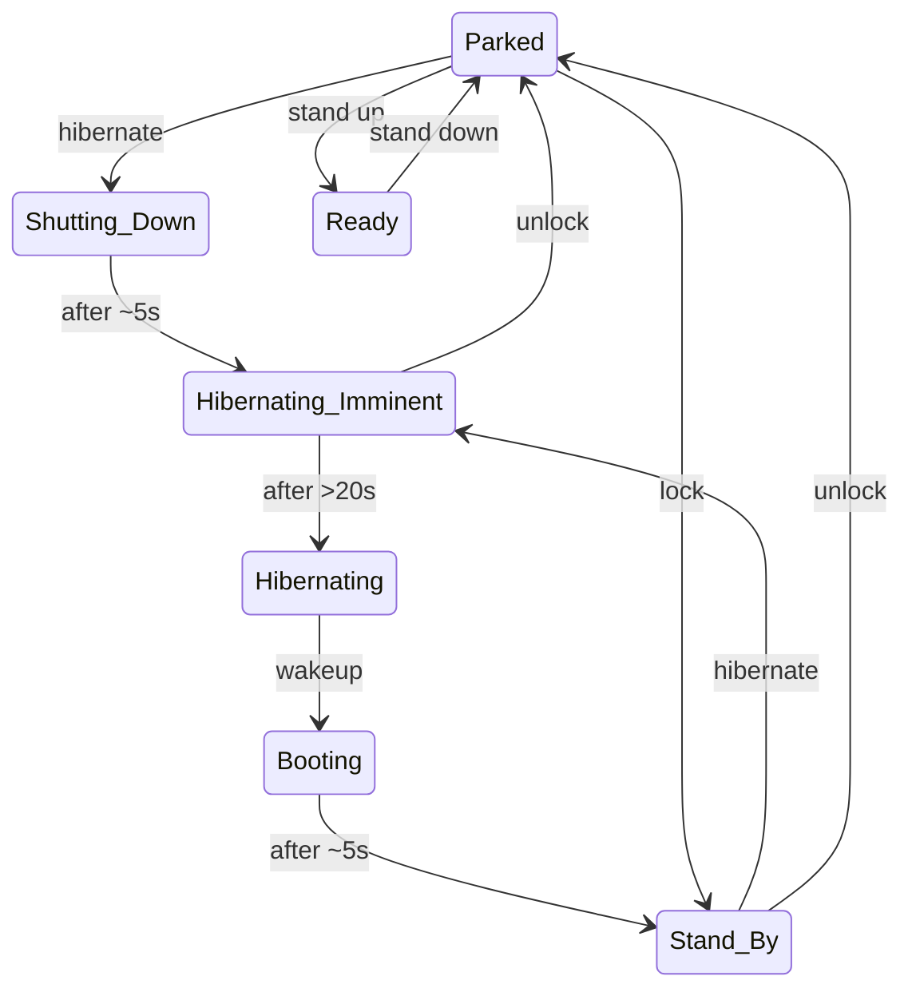

# System States Documentation

## Power States

The unu Scooter Pro has several distinct power states managed by the MDB and the BMD-340 ([Datasheet](https://content.u-blox.com/sites/default/files/BMD-340_DataSheet_UBX-19033353.pdf)) on it:

### Core States
- **Hibernating**
  - Lowest power state
  - Only wake-up circuitry active
  - Can be woken via NFC field detection or by pulling both brakes for 10s

- **Booting**
  - Transitional state during system startup
  - ~5 second duration
  - Transitions to Stand-By when complete

- **Stand-By**
  - Systems powered but motor disabled
  - Ready for user authentication
  - Can transition to Parked or Hibernating

- **Parked**
  - Stand-by state with kickstand down
  - Can transition to Ready when stand raised
  - Can transition to Shutting Down via hibernate command

- **Ready**
  - Full system power
  - Motor enabled
  - Transitions from Parked when stand raised
  - Returns to Parked when stand lowered

- **Shutting Down**
  - Transitional state before hibernation
  - ~5 second duration
  - Transitions to Hibernating Imminent

### Battery States

#### Main Battery
- **Asleep**
  - Lowest power state
  - NFC wake detection active
  
- **Idle** 
  - Systems powered
  - High current path disabled
  
- **Active**
  - Full power state
  - High current path enabled
  - Required for driving/charging

#### Connectivity Battery
- **Not Charging**
- **Charging**
- **Unknown**

#### Auxiliary Battery
- **Not Charging**
- **Bulk Charge**
- **Absorption Charge** 
- **Float Charge**

## Major Transition Sequences

### Power On
1. Hibernating -> Booting
   - Triggered by NFC field detection
   - Systems initialize during ~5s boot
2. Booting -> Stand-By  
   - Basic systems operational
   - Motor remains disabled
3. Stand-By -> Parked
   - User authentication required
   - Ready for kickstand actions

### Power Off
1. Parked -> Shutting Down
   - Triggered by hibernate command
   - Systems prepare for shutdown
2. Shutting Down -> Hibernating Imminent
   - Final state operations
   - ~5s duration
3. Hibernating Imminent -> Hibernating
   - After 20s timeout
   - Only wake detection remains active
